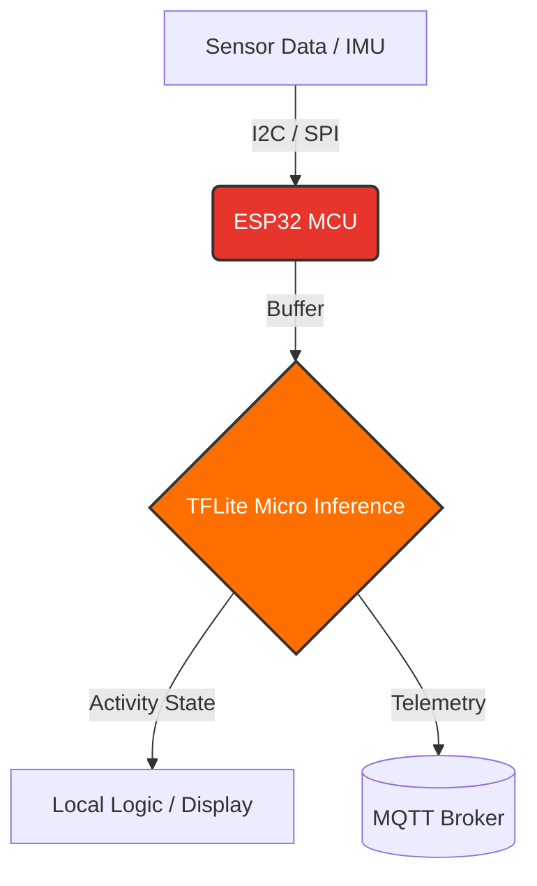

# CogniLog: On-Device Edge AI Productivity Assistant


## Overview

CogniLog is an embedded IoT assistant designed to track user focus and activity states entirely on the edge. By running inference directly on an ESP32 using TensorFlow Lite Micro, the system eliminates cloud dependency for real time processing, ensuring low latency and strict data privacy. An optional lightweight MQTT pipeline handles telemetry logging.

---

## System Architecture

> **Note:** See `assets/architecture.png` for the detailed hardware & software flow.



---

## Hardware & Firmware Specifications

| Parameter | Value |
|-----------|-------|
| Microcontroller | ESP32 (Xtensa Dual-Core 32-bit LX6 @ 240 MHz) |
| Framework | PlatformIO / ESP-IDF |
| Sensors | MPU6050 (IMU) |
| Sensor Protocol | I2C @ 400 kHz (fast-mode) |
| Telemetry Protocol | MQTT over WiFi |

---

## Edge AI Pipeline & Performance Metrics

The focus-tracking model was trained and quantized to fit within the strict memory constraints of the ESP32.
### (WIP-To be updated)

| Metric | Value |
|--------|-------|
| Model Type | DS-CNN |
| Quantization | INT8 |
| Inference Time | `[XX]` ms per frame |
| Flash Usage | `[XX]` KB |
| SRAM Peak (Arena) | `[XX]` KB — tuned to prevent heap exhaustion |
| Validation Accuracy | `[XX.X]`% |


---

## Memory Optimization Strategy

To fit the model alongside the WiFi/MQTT stack within the ESP32's 520 KB SRAM, the following memory conscious designs were implemented:

1. **Static tensor arena allocation** — prevents heap fragmentation by reserving a fixed block for the TFLite interpreter at startup.
2. **Direct sensor-to-buffer pipeline** — raw sensor reads written directly into the input tensor buffer, avoiding intermediate copies.

---

## Build & Flash Instructions

This project is built using PlatformIO.

**1. Clone the repository:**
```bash
git clone https://github.com/mohansudhandhiram-2k07/CogniLog.git
cd CogniLog
```

**2. Configure Wi-Fi and MQTT credentials:**
```bash
cp include/secrets.example.h include/secrets.h
# Edit secrets.h with your SSID, password, and MQTT broker details
```

**3. Build the firmware:**
```bash
pio run
```

**4. Flash and monitor:**
```bash
pio run --target upload --target monitor
```

---

## Project Status

> 🚧 **Actively in development.** Metrics and sensor details will be updated as the firmware matures.

| Milestone | Status |
|-----------|--------|
| Sensor pipeline (I2C) | ✅ Complete |
| TFLite Micro integration | 🔄 In Progress |
| MQTT telemetry | 🔄 In Progress |
| Memory profiling & tuning | ⏳ Pending |
| Final accuracy benchmarks | ⏳ Pending |

---
